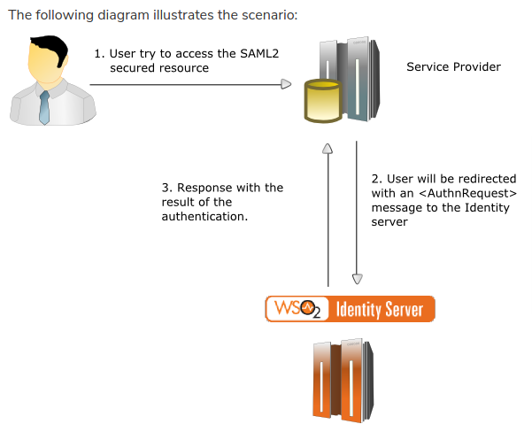
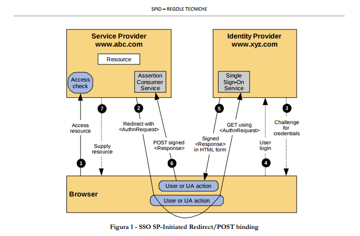

Appendice: SAML
===============

Il protocollo SAML in breve
---------------------------

SAML è il mezzo (o più specificatamente il framework/protocollo) 
attraverso cui SPID realizza la parte di autenticazione.

Le entità coinvolte nel protocollo SAML sono fondamentalmente 3:

1. l'utente che richiede l'accesso ad un servizio autenticato
2. il **Service Provider** (`SP`)che è il servizio web di cui l'utente vuole usufruire
3. l' **Identity Provider** (`IdP`) che è il server di autenticazione SSO e verifica le credenziali dell'utente

    La relazione tra i 3 soggetti del protocollo SAML

Più in dettaglio le fasi del processo di autenticazione sono mostrate come da schema seguente

    Le fasi del processo di autenticazione SAML

Ulteriori informazioni posso essere trovate:

.. todo: ampliare reference

* https://wiki.oasis-open.org/security/FrontPage
* https://docs.spring.io/spring-security-saml/docs/current/reference/html/configuration-metadata.html
